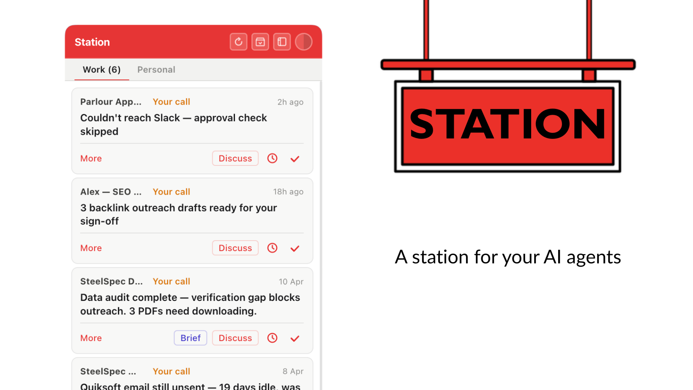

# Station

**A station for your AI agents.**

---

A station is a fixed point that things return to. Somewhere you hold your position, stay informed, and decide what happens next. In a world where agents go out and do the work, Station is where they come back to report in.

When an agent finishes a run, it drops a small update into a local folder and Station picks it up, showing you what it did, what files it created, and whether it needs anything from you before the next run. Things that need your attention sort to the top. Everything else waits quietly until you're ready.

It came out of a genuinely frustrating gap. Once you start running scheduled AI agents, work starts happening without you, which is the whole point, but you quickly realise you have no idea what actually happened. Did it run? Did it find anything useful? Did something go wrong at 3am and just sat there? You end up opening log files or checking outputs one by one, which defeats the purpose entirely.

And agents aren't just for work. You might have a personal assistant checking in on things outside of office hours, a reminder agent keeping track of something you're waiting on, or a home project that's ticking away in the background. Station keeps all of it in one place, with separate tabs for work and personal so nothing bleeds into the wrong part of your day.

Station was built by someone who is technical enough to set agents up, but wanted something visual and simple to stay across what they were actually doing. Not a dashboard full of metrics, just a clear, quiet widget that sits in the background and speaks up when it needs to. The kind of thing you barely notice until something needs your attention, and then it's right there.

It works with any AI agent that can write a file, whether that's Claude, ChatGPT, a custom script, or anything else. When something needs following up, the Discuss button copies a pre-filled message to your clipboard so you can paste it straight into whichever AI tool you use and pick up where the agent left off.

Station runs on your machine, nothing goes anywhere else, and there's no account or database involved, just a local folder your agents write to and a small app that reads it.

---



---

## Install

**Requirements:** macOS · Node.js 18+

```bash
git clone https://github.com/catrindonnelly/station.git
cd station
npm install
npm start
```

Station opens in widget mode on first launch and creates a config file at `~/.station/config.json`. Right-click anywhere in the widget to switch to app or menu bar mode. You can also cycle through four built-in themes — Station red, light, dark, and glass — using the theme button at the top of the widget.

### Run without a terminal (recommended)

To have Station start automatically at login and run in the background without keeping a terminal window open:

```bash
bash setup.sh
```

This creates `~/Applications/Station.app` and adds it as a macOS Login Item. You can close the terminal straight after and Station will be there every time you log in.

Custom inbox path:

```bash
bash setup.sh /path/to/your/inbox
```

---

## What you see

Each agent entry shows up as a card with one of four statuses:

| Status | What it means |
|--------|--------------|
| `error` | Something failed and needs your attention (sorts to top, shown in red) |
| `needs_input` | The agent is blocked and waiting on you |
| `fyi` | Work done, nothing urgent |
| `completed` | All finished, ready to dismiss |

You can tick items off, snooze them until 8am tomorrow, open the full brief the agent wrote, or copy a pre-filled message to pick up the conversation in your AI tool. Station refreshes automatically and shows a live badge count in the dock for anything urgent.

---

## Claude Code plugin

If you use Claude Code or Cowork, there's a plugin included in the `plugin/` folder that lets your agents post to Station directly without having to write the JSON themselves. Drop the plugin folder into your Claude plugins directory and it handles the rest.

---

## How agents post to Station

At the end of a run, your agent writes a JSON file to the inbox folder:

```json
{
  "agent": "seo-monitor",
  "agent_display": "SEO Monitor",
  "timestamp": "2026-04-08T09:00:00",
  "status": "needs_input",
  "category": "work",
  "headline": "Three pages dropped out of top 10 — manual review needed",
  "summary": "Pages /products, /about, and /contact lost ranking overnight. Likely a crawl issue. Checked sitemap — all present. Needs eyes before next scheduled run.",
  "actions_needed": [
    "Check Google Search Console for crawl errors",
    "Confirm sitemap is being picked up correctly"
  ],
  "files_created": [
    "outputs/seo-report-2026-04-08.md"
  ],
  "full_brief_path": "outputs/seo-brief-2026-04-08.md"
}
```

**File naming:** `[agent-name]-[YYYY-MM-DD-HHMM].json`

### Getting the most out of it

Station becomes genuinely useful when your agents are well identified. A few things that make a real difference in practice:

`agent_display` is what shows on the card, so give it a proper human-readable name rather than leaving it as the machine name. "SEO Monitor" or "Weekly Brief" reads much better than "seo-monitor-v2".

`headline` is the one line you'll read when you're scanning Station quickly, so make it specific enough to tell you whether you actually need to do something. "Run complete" tells you nothing. "Three pages dropped out of top 10, manual review needed" tells you exactly what you're dealing with.

`summary` is where the agent should give you enough context to act without having to open the full brief. Think of it as the agent explaining itself to you in a couple of sentences.

`category` routes entries to the right tab, so if you're running both work and personal agents, make sure each one sets this correctly. Anything without a category defaults to the Work tab.

The more clearly your agents identify themselves and describe what they did, the more Station feels like a proper briefing rather than a list of log entries.

### Status values

| Status | When to use |
|--------|-------------|
| `error` | Agent crashed or couldn't complete the run |
| `needs_input` | Agent is blocked and needs you to do something |
| `fyi` | Work done, no action needed |
| `completed` | Everything finished, nothing blocking |

### Category values

| Category | Tab |
|----------|-----|
| `work` | Work tab (default if omitted) |
| `personal` | Personal tab |

### Bash snippet

```bash
TIMESTAMP=$(date +%Y-%m-%dT%H:%M:%S)
INBOX="$HOME/Documents/Claude/agent-inbox"
cat > "$INBOX/my-agent-$(date +%Y-%m-%d-%H%M).json" << EOF
{
  "agent": "my-agent",
  "agent_display": "My Agent",
  "timestamp": "$TIMESTAMP",
  "status": "fyi",
  "category": "work",
  "headline": "Weekly report ready — 3 items flagged for review",
  "summary": "Run completed successfully. Found 3 items that need attention before next scheduled run.",
  "actions_needed": [],
  "files_created": []
}
EOF
```

---

## Configuration

Config lives at `~/.station/config.json`:

```json
{
  "inbox": "~/Documents/Claude/agent-inbox",
  "port": 2626,
  "tabs": ["Work", "Personal"],
  "mode": "widget"
}
```

| Key | Default | Description |
|-----|---------|-------------|
| `inbox` | `~/Documents/Claude/agent-inbox` | Folder Station watches for JSON entries |
| `port` | `2626` | Local port for the HTTP server |
| `tabs` | `["Work", "Personal"]` | Tab labels (maps to `category` in your JSON files) |
| `mode` | `widget` | `widget`, `app`, or `menubar` |
| `width` | `320` | Widget width in pixels (saved automatically on resize) |
| `height` | `600` | Widget height in pixels |
| `x` / `y` | — | Widget position (saved automatically on drag) |

---

## How it works

Station is a Node.js HTTP server that reads JSON files from your inbox folder and renders them as HTML. In Electron mode, `main.js` wraps the server in a native window with a live dock badge and system notifications, watching the inbox folder with `fs.watch()` so updates appear immediately. `setup.sh` creates a native macOS app wrapper and Login Item so the whole thing starts on login without a terminal.

Agents write files in, Station reads them out. Dismissed items move to `archived/`, snoozed items move to `snoozed/` and return the next morning.

---

## Uninstall

Delete the station folder. If you ran `setup.sh`, also remove the app and login item:

```bash
rm -rf ~/Applications/Station.app
rm -rf ~/.station
```

Then go to System Settings → General → Login Items and remove Station if it's still listed. Your inbox folder is left untouched.

---

## Built by

Station was built by [Catrin Donnelly](https://github.com/catrindonnelly), a solo founder who kept setting up agents and having no idea what they actually got up to. If something isn't working or you have an idea, open an issue and she'll take a look.

---

## Licence

MIT
